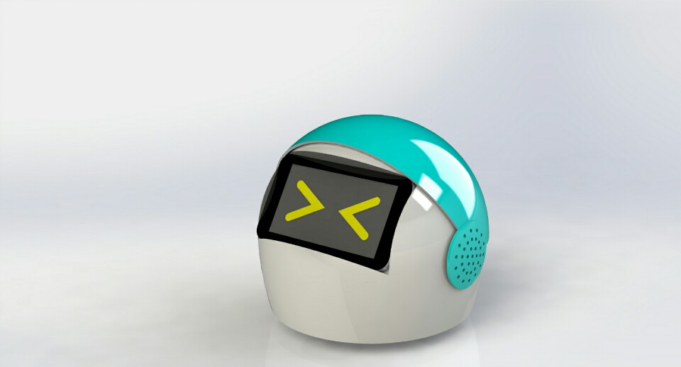
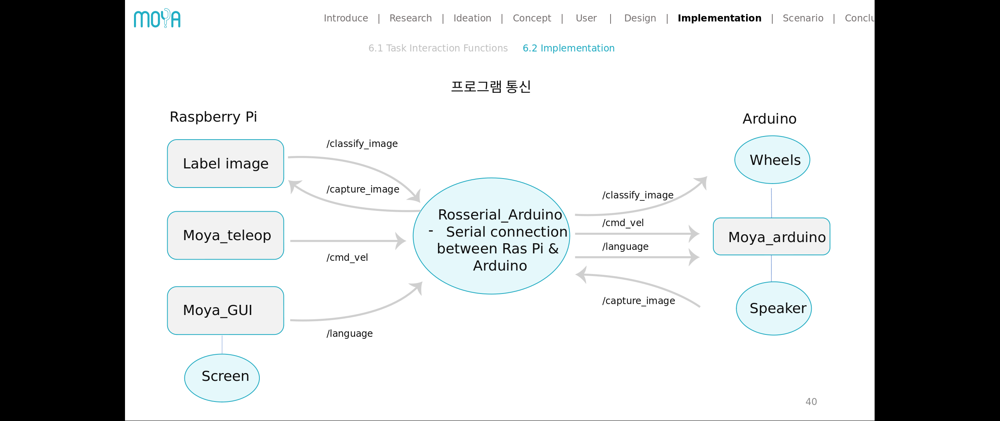

# MOYA - Deep Learning 기반 사물인식 기술을 이용한 언어학습 보조로봇
# SK CREATIVE CHALLENGE 2017 대상!




## SNU 로봇인공지능만들기 Code for MOYA Robot



## HOW TO:

### Setup
Clone to src folder in ROS workspace, and create package:

```
cd ~/catkin_ws/src
git clone https://github.com/dongwan123/moya
cd ..
catkin_make
```

### Running Teleop
Start Rosserial with arduino, then start the teleop node. First, init roscore:

```
roscore
```

On new terminal tabs each, run:
```
sudo chmod 666 /dev/ttyACM0
rosrun moya serial_node.py /dev/ttyACM0
rosrun moya move_robot.py
```

Now move the robot using w a s d keys

#### Teleop Example: https://youtu.be/QBffj18QRxU


## TO-DO:
### Controlling Robot wheels
- [x] Rosserial + Arduino
- [x] Teleop
### Object Recognition
- [x] Train images by retraining Mobilenet
- [x] Capture image with webcam and classify using retrained model
- [x] Output identified object to main
### Hand Motion Detection
- [x] Python wrapper for Intel RealSense + OpenCV
- [x] Calculate direction of hand
### UI integration
- [x] Make everything work smoothly with UI
- [ ] (Optional) Quiz Mode for users


